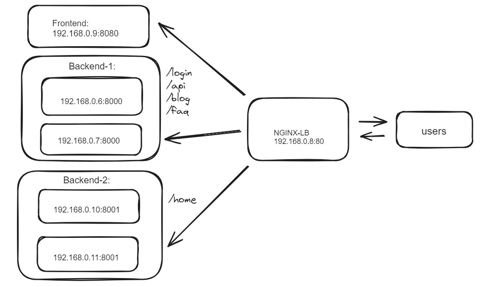

# NGINX Layer-7 HTTP Path-based Load Balancer:
NGINX is indeed a popular HTTP Layer 7 (L7) load balancer. It excels in handling HTTP and HTTPS traffic, providing a range of functionalities beyond basic load balancing.

This example shows a basic configuration where NGINX listens on port 80 for "idea.com" and proxies requests to a group of backend servers defined in the backend upstream.





In above picture, path-based routing in NGINX involves directing incoming requests to different backend servers or applications based on the URL path requested by the client. This can be achieved using NGINX's "location" directive in the configuration file. 

Let's say you have different applications running on your server, Backend1 path like /login, /api, /blog, /faq etc, and another Backend2 at like /home, and you want to route requests accordingly and one Frontend server. 

### Install Nginx:

```
### Ubuntu/Debian:

sudo apt update
sudo apt install nginx
```


```
### CentOS/RHEL:

sudo yum install epel-release
sudo yum install nginx
```

### NGINX server to act as a reverse proxy:

Configuring multiple server blocks (also known as virtual hosts) in Nginx allows you to host multiple websites or applications on the same server, each with its own domain name or IP address. Here's a basic example of how you can set up multiple server blocks in Nginx:

```
vim /etc/nginx/conf.d/server.conf

server {
    listen 8181;
    server_name example1.com;

    location / {
        root /var/www/html/example1.com;
        index index.html;
    }
}

server {
    listen 8182;
    server_name example2.com;

    location / {
        root /var/www/html/example2.com;
        index index.html;
    }
}

save and quit
```


The proxy_pass directive in Nginx is used to pass client requests to a specified backend server or servers. It's commonly used for reverse proxying, where Nginx acts as an intermediary between clients and backend servers. 

Here, you replace the port number, server name, and the backend server with the actual data. The example forwards all requests made to localhost to the http://127.0.0.1:8181 address.

```
vim /etc/nginx/conf.d/reverse.conf

#log_format      custom_log '$remote_addr - $remote_user [$time_local] '
#        '$server_name to: $upstream_addr [$request $status $body_bytes_sent] '
#        'upstream_response_time $upstream_response_time '
#        'msec $msec request_time $request_time ';


log_format custom_log '"Request: $request\n Status: $status\n Request_URI: $request_uri\n Host: $host\n Client_IP: $remote_addr\n Proxy_IP(s): $proxy_add_x_forwarded_for\n Proxy_Hostname: $proxy_host\n Real_IP: $http_x_real_ip\n User_Client: $http_user_agent"';

#log_format custom_log '$remote_addr - $remote_user [$time_local] '
#                           '"$request" $status $body_bytes_sent '
#                           '"$http_referer" "$http_user_agent" "$gzip_ratio"';


server {
    listen 80;
    server_name example1.com;

    access_log  /var/log/nginx/custom_access.log  custom_log;

    proxy_set_header Host $host;
    proxy_set_header X-Real-IP $remote_addr;
    proxy_set_header X-Forwarded-For $proxy_add_x_forwarded_for;
    proxy_set_header X-Forwarded-Proto $scheme;

    location / {
        proxy_pass http://127.0.0.1:8181;

       }
    }


save and quit
```


```
nginx -t
systemctl restart nginx
```


```
curl localhost -I
curl localhost -v
```


### Load Balancer Configuration:
Create a Load Balancer Configuration File locate the "/etc/nginx/nginx.conf"


### Test Configuration and Reload Nginx:
```
### Check configuration file and restart the service:

nginx -t
systemctl restart nginx

```

This configuration sets up an HTTP server block that listens on port 80. Requests to /login, /api, /blog and /home paths will be load balanced across the servers defined in the upstream block. Additional locations and corresponding backend servers can be added as needed.


## Building and Running the NGINX Load Balancer Docker Image:
Run the following commands in the directory where your Dockerfile and nginx.conf are located:

```
docker build -t nginx_lb .
docker run --name nginx_lb -dit -p 80:80 nginx_lb
```

Ensure that your Docker containers hosting the applications are reachable from the NGINX container and replace the server addresses in the NGINX configuration accordingly. Adjust the exposed ports and container names as needed based on your setup.

### FastAPI: 
Here's a simple example of creating an API endpoint using FastAPI. To containerize a FastAPI application using Docker, you'll create a Dockerfile to build an image and then run a container from that image.

```
docker build -t app1 .

docker run --name container_01 -dit -p 8000:8000 app1
```

Your FastAPI app should now be running inside a Docker container. You can access it by navigating to your browser or sending a GET request to that URL using a tool like curl or Postman.

http://127.0.0.1:8000/login

http://load_balancer_ip:/login


Remember, this is a basic setup. Depending on your app's complexity and needs, you might need to adjust the Dockerfile and configuration accordingly.

